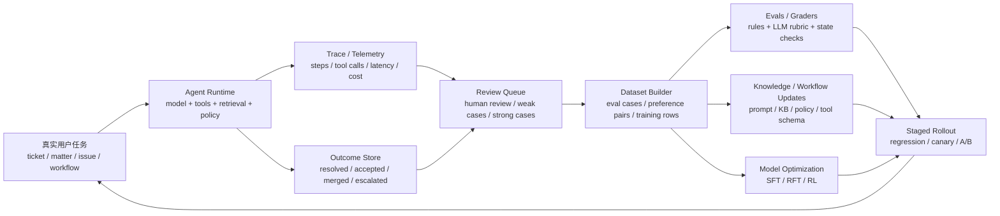

# 从数据飞轮到 Agentic RL：垂直 AI Agent 的持续改进闭环

- Created: 2026-04-10
- Updated: 2026-04-10
- Type: learning
- Status: verified
- Tags: data-flywheel, agentic-rl, agents, evals, rft, vertical-ai
- Model: GPT-5.4
- Harness: Codex
- Source: a structured synthesis of this session's discussion plus official materials from OpenAI, Anthropic, GitHub, Harvey, TikTok, Google Maps, and Tesla

> Metadata quick notes:
> `Model` = the underlying model itself.
> `Harness` = the agent/runtime layer wrapped around the model.
> Full definitions: `playbooks/repository/metadata-field-reference.md`

## 背景

这份笔记是为了把几个很容易被混成一团的话题拆开：

- 什么是数据飞轮
- 数据飞轮和普通“数据积累”有什么区别
- Agentic RL 和数据飞轮是什么关系
- 做垂直 AI agent 时，是否一定要形成自己的数据飞轮
- 如果真要做，工程上应该先做什么、后做什么

这几个概念容易混淆的原因是：

- 很多公司会直接把“我们有很多数据”说成“我们有飞轮”
- 很多 agent 团队会直接把“持续改进”理解成“要上 RL”
- 很多关于 AI agent 的讨论会同时混用 `feedback`、`evals`、`graders`、`reward`、`fine-tuning`、`telemetry` 这些不同层级的词

这份笔记的目标不是追求一个抽象定义，而是建立一个可落地的理解框架。

## 问题或目标

> 搞清楚数据飞轮、eval 飞轮、模型定制、Agentic RL 之间的关系，并把它们放回垂直 AI agent 的真实工程路径里。

## 先把整件事拆开

先把这件事拆成 4 层：

1. `一般意义上的数据飞轮`
   真实使用产生数据，数据反过来提升系统，提升后的系统又吸引更多或更高质量的使用。
2. `应用层飞轮`
   先不训练模型，而是把生产日志、人工 review、用户反馈变成 eval、知识库更新、工具规则和工作流改进。
3. `模型层飞轮`
   当任务分布足够稳定后，再把高质量数据拿去做 `SFT` 或 `RFT` 这类模型定制。
4. `Agentic RL`
   当任务是多步、可评分、能观察环境反馈、而且动作策略真的重要时，再进一步优化 agent 的行动策略。

一句话先记住：

> 数据飞轮不等于 Agentic RL。对大多数垂直 agent 来说，先跑起来的应该是 `eval + workflow` 飞轮，而不是一上来就做 RL。

## 一张总图



这张图里的关键点是：

- 真实世界先产生 `trace` 和 `outcome`
- `review` 和 `eval` 是飞轮的中间层
- `workflow update` 常常先于 `model training`
- 只有一部分场景会自然走到 `RFT / RL`

## 核心概念

### 1. 什么是数据飞轮

数据飞轮的重点不是“数据变多”，而是：

1. 系统在真实运行中产生数据
2. 这些数据被整理成可用于优化的信号
3. 这些信号反哺系统
4. 更好的系统继续产生更多、更高质量的数据

所以一个真正的数据飞轮，至少要同时满足这 4 个条件：

- 有明确目标，例如推荐更准、路线更准、任务完成率更高
- 数据能反哺系统，而不只是被存起来
- 反馈闭环跑得足够快
- 数据质量随着系统变好而提高

如果只有“海量日志”，但没有稳定的反馈、评估和更新机制，那只是数据堆积，不是飞轮。

### 2. 什么不是数据飞轮

下面这些都不应直接被叫做“数据飞轮”：

- 单纯把所有对话存下来
- 单纯采集用户点击或日志
- 只做 dashboard，不做迭代
- 只做一次性模型训练，没有持续回流
- 只改提示词，但没有测试和回归机制

飞轮的关键词是：

- `loop`
- `compounding`
- `feedback`
- `improvement`

### 3. 应用层飞轮、模型层飞轮、Agentic RL 的关系

最实用的理解方式，是把它们视为不同成熟度阶段，而不是互斥路线。

#### L0：没有飞轮

- 产品只是调用基础模型
- 出问题靠人手动改 prompt
- 没有系统化日志、评估和回归

#### L1：应用层飞轮

- 收集真实任务、失败案例、用户反馈、人工修正
- 把这些内容沉淀成 eval case、知识更新、工具规则、workflow 调整
- 先改 prompt、RAG、tool schema、handoff、planner/executor 结构

这是大多数垂直 agent 最该先做的阶段。

#### L2：模型层飞轮

- 任务分布开始稳定
- 已经积累了足够高质量的数据
- 有可以复用的 grader、rubric、专家评审或业务 outcome
- 开始做 `SFT` 或 `RFT`

这时飞轮开始从“应用迭代”扩展到“模型定制”。

#### L3：Agentic RL 飞轮

- 任务是多步的
- 行动策略重要
- 可以观察环境反馈
- 可以定义 reward 或至少定义可靠 grader
- 希望优化的不只是“说得更好”，而是“做得更对、更稳、更省”

这时才真正适合谈 Agentic RL。

### 4. 什么是 eval、grader、reward、telemetry

这几个词很容易混在一起。

#### `telemetry`

系统运行时产生的原始观测数据，例如：

- 请求内容
- tool calls
- latency
- token usage
- 用户是否接受结果

它是原材料，不等于评估。

#### `eval`

一组被明确整理过的测试或验证任务，用来比较不同版本系统的质量。

例如：

- 一组真实客服工单
- 一组法务检索任务
- 一组 issue-to-patch 编码任务

#### `grader`

把输出映射成分数或 pass/fail 的机制。

可以是：

- 规则检查
- 程序检查
- 单元测试
- 人工 rubric
- LLM judge

#### `reward`

当你进入 `RFT` 或更正式的 RL 时，最终用于驱动优化的标量反馈。

不是所有 eval 都必须变成 reward，但所有 RL 都必须有 reward 或 reward proxy。

### 5. 什么是 Agentic RL

Agentic RL 不只是“用 RL 训练一个会回答问题的模型”。

它更强调：

- agent 在多步任务里的动作选择
- 何时调用工具
- 何时检索
- 何时追问用户
- 何时停止继续搜索
- 何时转人工
- 如何在正确率、成本、时延、安全之间做策略平衡

对 agent 来说，RL 更像是在优化“行为策略”，而不是单纯优化“语言表面质量”。

OpenAI 的 `RFT` 文档把这件事讲得非常清楚：`reward` 来自你定义的 `custom grader`，训练循环是 `sample -> grade -> update`。[OpenAI RFT](https://developers.openai.com/api/docs/guides/reinforcement-fine-tuning)

## 把这些概念重新串起来

现在把前面的概念重新放回一条链路里：

1. 用户把真实任务交给系统
2. agent 运行时留下完整轨迹和业务结果
3. 团队从生产中筛出强样本、弱样本、失败样本和边界样本
4. 这些样本先沉淀成 eval、知识和 workflow 规则
5. 系统先做应用层改进
6. 当任务分布稳定后，再把高质量数据拿去做 `SFT / RFT`
7. 当任务是多步、策略重要、反馈明确时，再进一步做 Agentic RL

所以一条更现实的顺序通常是：

`observability -> evals -> workflow optimization -> SFT / RFT -> agentic RL`

而不是：

`有了 agent -> 直接 RL`

## 再往深一层：先看几个真实案例

这一节的目标不是穷举所有公司，而是通过官方案例建立直觉：

- 数据飞轮在推荐系统、地图、自动驾驶里是什么样
- 到了 AI agent 场景，飞轮为什么更依赖 `evals / graders / review`

### 1. TikTok：推荐飞轮的标准形态

TikTok 官方解释 `For You` 推荐时强调：

- 推荐会综合用户互动，例如点赞、分享、评论、关注和完播
- 每一次新的互动都会帮助系统继续学习兴趣
- 推荐系统会持续调整模型、权重和保护机制

这是一条很典型的推荐飞轮：

`使用 -> 互动信号 -> 推荐更准 -> 使用更多 -> 信号更丰富`

这里最重要的不是“用户手动打标签”，而是：

- 正常使用本身就在产生高价值反馈
- 完播和跳过这类隐式反馈的采样频率极高
- 推荐系统可以高速迭代

官方来源：

- [TikTok: How TikTok recommends videos #ForYou](https://newsroom.tiktok.com/how-tiktok-recommends-videos-foryou?lang=en)

### 2. Google Maps：世界模型飞轮

Google Maps 官方材料显示：

- Maps 每月有超过 `20 亿` 用户
- 每天会对地图做超过 `1 亿次` 更新
- ETA 预测结合了历史交通模式、实时交通和用户反馈

这条飞轮的重点不是“推荐内容”，而是持续更新世界状态：

`导航与上报 -> 地图/路况更新 -> ETA 和路线更准 -> 更多依赖 -> 更多数据`

它说明：

- 数据飞轮不一定是在训练一个 LLM
- 也可以是在刷新一个关于现实世界的动态模型

官方来源：

- [Google Maps updates: more than 2 billion users and over 100 million updates per day](https://blog.google/products-and-platforms/products/maps/gemini-google-maps-navigation-updates/)
- [Google Maps 101: traffic prediction and routing](https://blog.google/products-and-platforms/products/maps/google-maps-101-how-ai-helps-predict-traffic-and-determine-routes/)

### 3. Tesla：长尾场景飞轮

Tesla 官方材料显示：

- 全球车队每天可收集相当于 `500 多年` 连续驾驶的数据
- Fleet Learning 数据分享需要用户同意
- Fleet Learning 的目标是让系统更好地识别道路条件、车道线、标志和信号灯

这条飞轮最关键的点不是“数据量大”，而是：

- 真实世界里会不断出现长尾 corner cases
- 车队越大，越可能遇到更多边角场景
- 更强的模型能让更多真实使用持续发生

官方来源：

- [Tesla FY2025 Update: fleet data scale](https://ir.tesla.com/_flysystem/s3/sec/000162828026003837/tsla-20260128-gen.pdf)
- [Tesla Privacy Notice: Fleet Learning](https://www.tesla.com/legal/privacy)

## 再往深一层：真实的垂直 AI agent 案例

这一层更接近本笔记关心的问题：垂直 AI agent 到底怎么形成飞轮。

### 1. 客服 agent：OpenAI Support 和 Anthropic 的共同启发

OpenAI 官方支持案例里最重要的几点是：

- Agents SDK 提供 `step-level traces`
- 可以 replay run、检查 tool calls、定位根因
- 一线支持人员会把强/弱案例转成 eval
- 这些 eval 会持续在生产中运行
- 支持团队不仅处理工单，也参与 classifier、knowledge 和 fine-tuning 数据建设

Anthropic 的 evals 文章则强调：

- 会话 agent 的成功通常是多维的
- 例如：是否解决问题、是否在一定轮数内完成、语气是否合适

Anthropic 的客服 guide 还明确建议：

- 长上下文静态知识适合用 `RAG`
- 实时状态查询和执行动作适合用 `tool use`

这些案例共同说明：

- 客服 agent 最先形成的通常不是 RL 飞轮
- 而是 `trace -> review -> eval -> policy / KB / workflow update` 的 eval 飞轮

官方来源：

- [OpenAI: Improving support with every interaction at OpenAI](https://openai.com/index/openai-support-model/)
- [Anthropic: Demystifying evals for AI agents](https://www.anthropic.com/engineering/demystifying-evals-for-ai-agents)
- [Anthropic: Customer support agent guide](https://platform.claude.com/docs/en/about-claude/use-case-guides/customer-support-chat)

### 2. 法务 agent：Harvey、BigLaw Bench 和 OpenAI Pioneers

OpenAI 与 Harvey 的官方案例说明：

- 双方为法律场景做了定制 case-law 模型
- 加入了相当于 `100 亿 tokens` 的美国判例法数据
- 律师对定制模型的输出偏好明显高于通用 GPT-4

Harvey 的 `BigLaw Bench` 更重要，它把真实律师工作抽象成 benchmark：

- 任务设计来自真实 `time entries`
- benchmark 不是随意编一些问题，而是对真实高价值 legal work 建模

OpenAI 的 `Pioneers Program` 和 `RFT` 文档则进一步说明：

- 目标是做 narrow domain 的 expert models
- `RFT` 适合复杂、可评分、专家能够给出稳定判断的任务
- 官方示例明确提到：`determining relevant passages from legal case law`

这说明法务场景很适合：

- 先做领域 benchmark
- 再做专家 review 和 preference data
- 然后做 `RFT`

而不是一开始直接在线 RL。

官方来源：

- [OpenAI: Customizing models for legal professionals](https://openai.com/index/harvey/)
- [Harvey: Introducing BigLaw Bench](https://www.harvey.ai/brand/blog/introducing-biglaw-bench)
- [OpenAI: Pioneers Program](https://openai.com/index/openai-pioneers-program/)
- [OpenAI API: Reinforcement fine-tuning](https://developers.openai.com/api/docs/guides/reinforcement-fine-tuning)

### 3. Coding agent：最接近 Agentic RL 的理想场景

这一类场景最特殊，因为环境反馈往往最明确。

Anthropic 的 evals 文章强调：

- 对 coding agent，deterministic graders 很自然
- 单元测试和构建通过率是天然反馈
- 除了 pass/fail，还可以再评 transcript，例如 tool use 是否合理

GitHub 官方说明：

- 他们对 Copilot 模型做 `offline / pre-production / production` 多层评估
- offline eval 看 `build-and-test pass rates`
- production 指标看 `accepted-and-retained characters`、acceptance rate 等
- 企业版 fine-tuned Copilot 会结合私有代码库和团队交互 telemetry 做定制

Anthropic 的 Graphite 客户案例说明：

- 他们用 `500` 个 PR 做严格评估
- AI review comment 的正反馈率达到 `96%`
- 建议实现率达到 `67%`

OpenAI 对 Codex 的官方描述更进一步：

- `codex-1` 是在真实 coding tasks 上用 reinforcement learning 训练的
- 可以迭代运行测试直到通过

这些案例共同说明：

- coding agent 非常适合先做 deterministic eval flywheel
- 当动作空间是多步且测试反馈清晰时，也最适合进一步做 Agentic RL

官方来源：

- [Anthropic: Demystifying evals for AI agents](https://www.anthropic.com/engineering/demystifying-evals-for-ai-agents)
- [GitHub: Building a better custom model for Copilot](https://github.blog/ai-and-ml/github-copilot/the-road-to-better-completions-building-a-faster-smarter-github-copilot-with-a-new-custom-model/)
- [GitHub: Fine-tuned models for Copilot Enterprise](https://github.blog/news-insights/product-news/fine-tuned-models-are-now-in-limited-public-beta-for-github-copilot-enterprise/)
- [Anthropic x Graphite](https://claude.com/customers/graphite)
- [OpenAI: Introducing Codex](https://openai.com/index/introducing-codex/)

## 三类垂直 agent 的系统设计

这一节不是在复述某家公开的完整内部架构，而是根据上面的官方案例，抽取出一个可落地的工程设计。

要特别注意：

- 下面的 `schema` 和 `reward` 设计是工程推演，不是对 OpenAI、Anthropic、Harvey、GitHub 或 Graphite 内部实现的逐字复原
- 但它们和官方公开的 `trace`、`evals`、`graders`、`telemetry`、`RFT`、`real-world tasks` 这些机制是同构的

### 客服 agent

#### 适合记录的数据对象

| 数据对象 | 建议字段 | 作用 |
| --- | --- | --- |
| `ticket` | `ticket_id`, `channel`, `intent`, `created_at`, `final_status` | 记录工单级任务 |
| `agent_run` | `run_id`, `ticket_id`, `model_version`, `policy_version`, `kb_version`, `n_turns`, `latency_ms`, `cost`, `handoff_triggered` | 记录一次 agent 运行 |
| `tool_call` | `run_id`, `tool_name`, `tool_success`, `tool_latency_ms` | 记录动作执行 |
| `review_event` | `ticket_id`, `reviewer_type`, `label_type`, `label_value`, `notes` | 记录人工标注和强弱样本 |
| `eval_case` | `case_id`, `scenario`, `expected_state`, `rubric_version` | 记录回归测试样本 |
| `business_outcome` | `ticket_id`, `resolved`, `reopened`, `csat`, `escalated` | 记录真实业务结果 |

#### 最该先做的 eval

- `state check`：问题有没有真的解决
- `policy check`：是否遵守退款、升级、隐私等规则
- `interaction rubric`：语气是否合适、解释是否清楚
- `efficiency`：是否在合理轮数内完成
- `handoff quality`：该转人工时是否转对了

#### reward 应该怎么理解

客服场景里，通常先不要急着把所有东西压成一个 RL reward。

更稳的做法是：

1. 先做多维 graders
2. 先跑 eval flywheel
3. 先优化 prompt、tool schema、RAG、handoff、classifier
4. 等业务稳定后，再考虑把这些 grader 聚合成 reward

#### 典型迭代流程

```text
生产工单
  ↓
抽取强样本 / 弱样本 / 高投诉样本
  ↓
支持和 QA 标注
  ↓
形成 eval case、policy case、classifier rule
  ↓
更新 KB / prompt / handoff / tools
  ↓
回归测试 + canary
  ↓
再进生产
```

### 法务 agent

#### 适合记录的数据对象

| 数据对象 | 建议字段 | 作用 |
| --- | --- | --- |
| `legal_matter` | `matter_id`, `practice_area`, `jurisdiction`, `task_type` | 记录案件或法务任务 |
| `source_document` | `doc_id`, `matter_id`, `doc_type`, `citation_metadata` | 记录证据和法源 |
| `agent_run` | `run_id`, `matter_id`, `workflow_type`, `model_version`, `retrieval_version` | 记录一次法务生成过程 |
| `retrieval_hit` | `run_id`, `source_doc_id`, `rank`, `selected_in_answer` | 记录检索命中 |
| `legal_output` | `run_id`, `output_type`, `text`, `citations`, `draft_version` | 记录生成结果 |
| `lawyer_review` | `run_id`, `accepted`, `major_edits`, `error_type`, `preference_pair_id` | 记录律师审阅 |
| `benchmark_case` | `case_id`, `task_prompt`, `reference_materials`, `grading_rubric_version` | 记录 benchmark 任务 |

#### 最该先做的 eval

- `grounding / citation validity`
- `factuality`
- `jurisdiction correctness`
- `task completion`
- `legal usefulness`
- `human preference`

#### reward 应该怎么理解

法务场景更适合：

- 先做领域 benchmark
- 再做律师 review 和 preference data
- 再做 `RFT`

因为这里最关键的不是“随机探索动作”，而是：

- 判断是否引用了正确法源
- 是否覆盖关键问题
- 是否减少律师后续修改量

#### 典型迭代流程

```text
真实法律任务
  ↓
抽取可匿名化样本
  ↓
律师 side-by-side review / preference / error taxonomy
  ↓
形成 benchmark + eval + preference pairs
  ↓
先优化 retrieval / workflow / grounding
  ↓
再做 task-specific SFT / RFT
```

### Coding agent

#### 适合记录的数据对象

| 数据对象 | 建议字段 | 作用 |
| --- | --- | --- |
| `coding_task` | `task_id`, `repo`, `task_type`, `source` | 记录 issue / PR / review 任务 |
| `repo_snapshot` | `task_id`, `commit_sha`, `branch` | 固定任务环境 |
| `agent_run` | `run_id`, `task_id`, `model_version`, `n_steps`, `n_toolcalls`, `latency_sec`, `total_tokens` | 记录 agent 执行轨迹 |
| `tool_event` | `run_id`, `tool_name`, `success`, `duration_ms` | 记录读写文件、跑测、搜索等动作 |
| `test_result` | `run_id`, `suite_name`, `passed`, `failures` | 记录环境反馈 |
| `static_analysis_result` | `run_id`, `linter`, `severity`, `count` | 记录质量反馈 |
| `review_signal` | `run_id`, `comment_accepted`, `diff_reworked`, `merged`, `reverted` | 记录开发者反馈 |
| `production_metric` | `model_version`, `acceptance_rate`, `accepted_retained_chars`, `merge_rate`, `build_success_rate` | 记录线上价值指标 |

#### 最该先做的 eval

- `correctness`：tests 是否通过
- `build health`：build / typecheck / lint
- `code quality`：static analysis / review rubric
- `task completion`：issue 是否真正解决
- `developer utility`：acceptance、retained chars、suggestion implementation rate
- `safety`：是否引入漏洞或破坏 repo 约束

#### reward 应该怎么理解

这类场景最适合真正做 Agentic RL，因为：

- 环境反馈清晰
- 多步动作链明显
- tool use 很重要
- 成功和失败往往可程序化判断

典型 reward 可能来自：

- tests pass / fail
- build pass / fail
- static analysis penalties
- review suggestion accepted / ignored
- merge / revert
- time and token budget penalties

#### 典型迭代流程

```text
真实编码任务
  ↓
固定仓库快照 + 运行 agent
  ↓
记录完整 trace + tests/build/static analysis
  ↓
形成 regression set + task set + telemetry dashboard
  ↓
先优化 workflow / tools / policies
  ↓
再做 SFT / RFT
  ↓
如果 reward 稳定，再做 Agentic RL
```

## 什么时候应该做数据飞轮，什么时候不必强求

不是所有 AI agent 都必须形成强数据飞轮。

### 更适合飞轮的场景

通常满足下面这些条件中的多数：

- 任务重复度高
- 任务量足够大
- 专家能判断好坏
- 成功与失败会带来真实业务差异
- 可以观察到环境反馈
- 系统会持续迭代，而不是一次性交付

典型就是：

- 客服
- 法务
- 医疗文书
- 财税审单
- 合规审核
- 运维告警处理
- coding / code review

### 不一定需要强飞轮的场景

- 低频、一次性任务
- 用户量很小
- 任务定义变化过快
- 无法获得可靠反馈
- 成本还不足以支持持续标注和回归

这类场景可以先把产品跑通，不必强行套一个重飞轮框架。

## 最容易混淆的点

### 1. 数据飞轮不等于“有很多数据”

没有反馈闭环和持续迭代的日志，只是存量，不是飞轮。

### 2. 数据飞轮不等于 Agentic RL

飞轮可以先发生在：

- eval
- classifier
- retrieval
- knowledge
- workflow

而不是一定发生在 RL。

### 3. 模型训练不等于飞轮的起点

很多垂直 agent 的第一阶段收益最大的是：

- prompt
- tool schema
- RAG
- routing
- handoff
- policy enforcement

### 4. reward 不是随便定义一个分数就行

如果 reward 设计不好，很容易出现：

- reward hacking
- 只学会讨好 grader
- 指标上涨但真实质量下降

### 5. 不是所有反馈都一样值钱

通常从低到高大致可以这样理解：

- 原始 telemetry
- 用户显式反馈
- 程序化环境反馈
- 专家 review
- 结构化 preference / rubric / benchmark

### 6. 垂直领域更适合飞轮，但治理要求也更高

垂直领域的优势是：

- 任务分布稳定
- 正确性标准更清晰

但风险也更高：

- 隐私
- 合规
- label drift
- rubric drift
- 数据污染

## 一句话心智模型

- 数据飞轮的核心不是“多数据”，而是“可反哺系统的数据闭环”。
- 大多数垂直 agent 应先建立 `eval flywheel`，再考虑 `RFT / RL`。
- `telemetry` 是原材料，`eval` 是整理后的测试集，`grader` 是评分机制，`reward` 是优化信号。
- 客服最先受益于 `trace + review + eval + workflow`。
- 法务最先受益于 `benchmark + expert review + RFT`。
- Coding 最适合进一步走向 `Agentic RL`，因为环境反馈最明确。

## 注意事项

- 不同公司的“数据飞轮”未必用同一个词来描述，很多时候这是对官方材料的结构化归纳。
- 本文中的系统图和数据表设计，是基于官方案例抽象出来的工程框架，不是这些公司的公开内部实现。
- 垂直领域如果涉及敏感数据，必须把隐私、合规、脱敏和数据使用边界放在飞轮前面。
- `RFT` 和更一般的 `agentic RL` 都依赖可靠 grader；如果 grader 本身不稳定，训练很容易学偏。
- 上述官方案例和指标都可能在未来继续演进，因此最好把它们理解为“设计启发”，而不是永久不变的配方。

## 验证

- 2026-04-10：基于本次讨论重新梳理数据飞轮、eval、RFT 与 Agentic RL 的关系
- 2026-04-10：核对官方资料并提取关键事实：
  - TikTok `For You` 推荐机制
  - Google Maps 路况预测与地图更新
  - Tesla Fleet Learning
  - OpenAI Support 内部案例
  - Anthropic agent evals 与客服 guide
  - OpenAI x Harvey 定制法务模型
  - Harvey `BigLaw Bench`
  - OpenAI `Pioneers Program`
  - OpenAI `Reinforcement fine-tuning`
  - OpenAI `Codex`
  - GitHub Copilot custom / fine-tuned models
  - Anthropic x Graphite

## 相关笔记

- [未来科研方向](../ideas/future-research-directions.md)
- [从 nanobot 拆主 agent、中控、调度、队列与上下文管理](nanobot-agent-control-center-analysis.md)

## 参考

- [TikTok: How TikTok recommends videos #ForYou](https://newsroom.tiktok.com/how-tiktok-recommends-videos-foryou?lang=en)
- [Google Maps 101: How AI helps predict traffic and determine routes](https://blog.google/products-and-platforms/products/maps/google-maps-101-how-ai-helps-predict-traffic-and-determine-routes/)
- [Google Maps updates: Gemini arrives, navigation updates, and more](https://blog.google/products-and-platforms/products/maps/gemini-google-maps-navigation-updates/)
- [Tesla FY2025 Update](https://ir.tesla.com/_flysystem/s3/sec/000162828026003837/tsla-20260128-gen.pdf)
- [Tesla Privacy Notice](https://www.tesla.com/legal/privacy)
- [OpenAI: Improving support with every interaction at OpenAI](https://openai.com/index/openai-support-model/)
- [Anthropic: Demystifying evals for AI agents](https://www.anthropic.com/engineering/demystifying-evals-for-ai-agents)
- [Anthropic: Customer support agent guide](https://platform.claude.com/docs/en/about-claude/use-case-guides/customer-support-chat)
- [OpenAI: Customizing models for legal professionals](https://openai.com/index/harvey/)
- [Harvey: Introducing BigLaw Bench](https://www.harvey.ai/brand/blog/introducing-biglaw-bench)
- [OpenAI: Pioneers Program](https://openai.com/index/openai-pioneers-program/)
- [OpenAI API: Reinforcement fine-tuning](https://developers.openai.com/api/docs/guides/reinforcement-fine-tuning)
- [OpenAI: Introducing Codex](https://openai.com/index/introducing-codex/)
- [GitHub: Building a better custom model for Copilot](https://github.blog/ai-and-ml/github-copilot/the-road-to-better-completions-building-a-faster-smarter-github-copilot-with-a-new-custom-model/)
- [GitHub: Fine-tuned models for GitHub Copilot Enterprise](https://github.blog/news-insights/product-news/fine-tuned-models-are-now-in-limited-public-beta-for-github-copilot-enterprise/)
- [Anthropic x Graphite](https://claude.com/customers/graphite)
