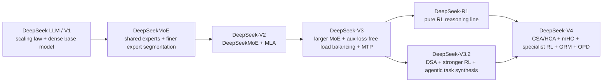

# DeepSeek V1-V4 研究路线笔记

- Created: 2026-04-29
- Updated: 2026-04-29
- Type: learning
- Status: draft
- Tags: deepseek, llm-training, pretraining, posttraining, moe, long-context, rl
- Model: GPT-5.4
- Harness: Codex
- Source: organized from a user-provided Bilibili video summary and verified against official DeepSeek papers, reports, and transparency pages

## 背景

这份笔记的目标，不是把 DeepSeek 每一篇论文都逐页复述一遍，而是先建立一条可持续研究的主线：

- 用 `DeepSeek LLM / V1` 到 `V4` 的演变，理解近两年前沿大模型的训练范式变化
- 把视频里的通俗叙事，重新对齐到官方论文里的真实技术节点
- 为后续再看 `MiMo-V2-Flash` 做一个更稳的参照系

这份笔记会持续增量更新。当前版本优先解决“总路线、关键动机、代表方法和学习顺序”，而不是把所有公式一次讲完。

## 问题或目标

> 用 DeepSeek 这条技术路线，建立对最新大模型预训练、架构优化、后训练和系统工程范式的整体理解。

## 先把名字讲清楚

在视频或二手总结里，常会把 DeepSeek 的路线简化成 `V1 -> V2 -> V3 -> V4`。这个讲法有助于建立直觉，但如果直接拿来记技术史，很容易混乱。

当前更准确的理解是：

1. 视频里说的 `V1`，更接近官方的早期基础模型阶段，也就是 **DeepSeek LLM**，重点是 `scaling law` 与基础预训练。
2. `R1` 不是 `V4` 的一个附属章节，而是 **后训练范式** 的独立跃迁：它在问“推理能力能不能主要靠 RL 长出来”。
3. `V3.2` 是连接 `V3/R1` 与 `V4` 的桥，尤其重要，但本笔记当前把它视为“需要下一轮精读”的过渡节点。

所以更适合学习的路线不是单纯版本故事，而是：

- `预训练路线`
- `架构路线`
- `后训练路线`
- `系统工程路线`

## 先给总判断

如果只用一句话概括 DeepSeek 的演变：

> DeepSeek 不是在单纯把模型做大，而是在同时推进四件事：更合理的 scaling、更经济的稀疏架构、更强的 RL 推理、更可控的长上下文与大规模训练系统。

把这条路线压成最短版本，大致是：

- `DeepSeek LLM / V1`：先把基础模型和 `scaling law` 弄清楚
- `DeepSeekMoE + V2`：解决“怎么更便宜地把模型做大、把推理做快”
- `V3`：解决“怎么把稀疏大模型稳定地训练到超大规模”
- `R1`：解决“推理能力能不能主要靠 RL 训练出来”
- `V4`：解决“怎么把长上下文、稳定训练、specialist RL 和能力融合整合到同一代模型里”

## 一张总图

## 版本对照表

| 阶段 | 代表材料 | 主要动机 | 核心方法 | 一句话本质 |
| --- | --- | --- | --- | --- |
| DeepSeek LLM / `V1` 起点 | [DeepSeek LLM](https://arxiv.org/abs/2401.02954), 2024-01-05 | 先把开源基础模型的 `scaling law`、数据和训练配比做对 | dense transformer、scaling law、后训练以 `SFT + DPO` 为主 | 先把“基础盘”打稳 |
| DeepSeekMoE | [DeepSeekMoE](https://arxiv.org/abs/2401.06066), 2024-01-11 | dense 模型继续变大时，计算成本过高 | finer-grained experts、shared experts | 用更聪明的稀疏化替代简单堆参数 |
| DeepSeek-V2 | [DeepSeek-V2](https://arxiv.org/abs/2405.04434), 2024-05-07 | 同时降低训练成本、推理成本和 KV cache 成本 | `DeepSeekMoE + MLA` | 稀疏 FFN 和压缩注意力一起落地 |
| DeepSeek-V3 | [DeepSeek-V3 Technical Report](https://arxiv.org/abs/2412.19437), 2024-12-27 | 让超大 MoE 模型在真实工程中稳定、便宜地训练出来 | `MLA`、`DeepSeekMoE`、aux-loss-free load balancing、`MTP` | 真正把“超大稀疏模型训练系统”跑通 |
| DeepSeek-R1 | [DeepSeek-R1](https://arxiv.org/abs/2501.12948), 2025-01-22 | 让 reasoning 不只靠 SFT，而是靠 RL 真正长出来 | `R1-Zero`、pure RL、multi-stage RL、cold-start data | 推理能力成为一条独立后训练主线 |
| DeepSeek-V3.2 | [DeepSeek-V3.2](https://arxiv.org/abs/2512.02556), 2025-12-01 | 把 reasoning、agent 与长上下文效率进一步结合 | `DSA`、更大规模 RL、agentic task synthesis | 是通向 V4 的过渡桥梁 |
| DeepSeek-V4 | [DeepSeek-V4](https://huggingface.co/deepseek-ai/DeepSeek-V4-Pro/resolve/main/DeepSeek_V4.pdf), 2026-04-24 | 把超长上下文、稳定训练、specialist post-training 和能力融合整合起来 | `CSA/HCA`、`mHC`、`GRM`、`OPD`、million-token curriculum | 前几代技术积累的阶段性总整合 |

## 四条演进线

### 1. 预训练线

这一条线在回答：

> 数据、模型规模、上下文长度和训练目标，怎样组合才能让基础模型继续有效扩张？

从 DeepSeek 路线看，重点依次变成：

- `scaling law`
- 稀疏架构下的大规模预训练
- 更长上下文的 curriculum
- `MTP` 这类更强训练目标
- 优化器和数值稳定性

### 2. 架构线

这一条线在回答：

> 不只是把 transformer 堆大，而是怎样改它，才能让训练和推理都更便宜？

DeepSeek 的代表动作是：

- `FFN -> DeepSeekMoE`
- `MHA / GQA / MQA` 之外的 `MLA`
- 更长上下文里的 `DSA`、`CSA/HCA`
- 通过 `mHC` 改善残差/连接结构

### 3. 后训练线

这一条线在回答：

> 模型会说话，不等于模型会推理；模型会推理，也不等于模型能在复杂任务里持续做对。那后训练应该怎么演化？

这条线的大致变化是：

- `SFT + DPO`
- `SFT + RL`
- `R1-Zero` 代表的 pure RL 推理路线
- `specialist SFT + GRPO`
- `GRM`
- `OPD`

### 4. 系统工程线

这一条线在回答：

> 再好的算法，如果训练不稳、服务不起、KV cache 爆炸、长上下文跑不动，就无法真正成为一代模型。

所以 DeepSeek 的路线里，系统工程不是附属品，而是主线的一部分：

- 训练成本控制
- 长上下文计算与缓存管理
- 稀疏路由稳定性
- rollout / RL 基础设施
- serving 和 deployment 的可行性

## 逐代拆解

### 1. DeepSeek LLM / `V1` 起点：先把 scaling law 和基础盘做对

#### 它在解决什么

DeepSeek 的起点不是“先做一个很花哨的新架构”，而是更底层的问题：

> 如果要持续训练自己的大模型，数据规模、模型规模、超参数和算力到底该怎么配？

#### 它的方法

在 [DeepSeek LLM](https://arxiv.org/abs/2401.02954) 里，重点是：

- 建立 base model 与 chat model
- 研究 `scaling laws for hyperparameters`
- 估计最优的模型和数据 scaling
- 在后训练阶段采用更传统的 `SFT + DPO`

#### 这一步为什么重要

这一步的重要性不在于“性能最炸裂”，而在于：

- 它奠定了后续所有更大模型的配比逻辑
- 它说明 DeepSeek 一开始就把“训练规律”当成核心研究对象
- 它让后面的 MoE、长上下文、RL 不至于建立在不稳的基础盘上

#### 直觉理解

这一步更像是：

> 先学会怎么正确地造发动机，再谈怎么加涡轮和上赛车套件。

### 2. DeepSeekMoE + V2：解决“更便宜地做大模型”

#### 它在解决什么

dense 模型继续变大后，瓶颈非常直接：

- 参数多
- 计算贵
- 推理慢
- KV cache 显存压力大

所以这一步的核心，不是只提升 benchmark，而是：

> 怎样在不按 dense 成本线性爆炸的前提下，把模型继续做强？

#### DeepSeekMoE 的关键点

[DeepSeekMoE](https://arxiv.org/abs/2401.06066) 最关键的两点是：

- 把专家切得更细，形成更灵活的 expert 组合
- 单独保留 shared experts，捕捉公共知识，减少 routed experts 的冗余

它本质上在解决一个经典 MoE 问题：

> MoE 不只是“少算一点”，还要让专家真的产生更清晰的专业分工，而不是学成一堆高度重叠的子网络。

#### DeepSeek-V2 的关键点

到了 [DeepSeek-V2](https://arxiv.org/abs/2405.04434)，这条线第一次非常完整地落地：

- `236B` total parameters
- `21B` activated parameters per token
- `128K` context
- 预训练 `8.1T` tokens
- 继续采用 `SFT + RL`

更重要的是两项代表技术：

- `DeepSeekMoE`
- `MLA`（Multi-head Latent Attention）

#### MLA 为什么重要

`MLA` 的直觉不是“又发明了一个注意力缩写”，而是：

> 想办法把推理里最贵的 `KV cache` 压缩到 latent 表示里，让长上下文和高吞吐更现实。

V2 报告明确给出的结果是：

- 相比 DeepSeek 67B，训练成本下降 `42.5%`
- `KV cache` 降低 `93.3%`
- 最大生成吞吐提升到 `5.76x`

#### 这一步的本质

V2 不是单点性能优化，而是第一次把“**经济的 MoE + 经济的注意力**”组合成一条完整路线。

### 3. V3：解决“怎么把超大稀疏模型真正训练出来”

#### 它在解决什么

V2 证明了这套方向可行，但还不等于：

- 能稳定训练到超大规模
- 能把训练成本压到足够低
- 能在不崩的情况下持续提升能力

V3 的核心问题因此变成：

> 不是“有架构”，而是“如何把这套架构真正训练成前沿模型”。

#### 它的方法

[DeepSeek-V3 Technical Report](https://arxiv.org/abs/2412.19437) 给出的关键点非常清楚：

- `671B` total parameters
- `37B` activated parameters per token
- 继承 `MLA + DeepSeekMoE`
- 引入 `auxiliary-loss-free` 的 load balancing
- 引入 `MTP`（multi-token prediction）
- 预训练 `14.8T` tokens
- 全训练仅用 `2.788M H800 GPU hours`

而且报告还特别强调：

- 整个训练过程中没有出现不可恢复的 loss spike
- 没有进行 rollback

#### 为什么 `MTP` 值得特别学

`MTP` 的意义不只在训练目标更强，还在于它把训练和推理效率联系起来了：

- 训练时：模型不只学下一个 token，而是更丰富的未来预测
- 推理时：可以支持更激进的 speculative decoding 设计

#### 这一步的本质

V3 代表的不是“又大一点的 V2”，而是：

> DeepSeek 已经把“超大稀疏前沿模型的预训练与工程稳定性”跑成了一条成熟路线。

### 4. R1：把“推理能力来自哪里”单独拉成一条主线

#### 它在解决什么

V3 很强，但“强 base / chat 模型”和“强 reasoning 模型”不是一回事。

R1 这条线真正想回答的是：

> 推理能力到底能不能主要靠 RL 自己长出来，而不是只能靠监督链路灌进去？

#### 它的方法

[DeepSeek-R1](https://arxiv.org/abs/2501.12948) 的关键信息是：

- `DeepSeek-R1-Zero` 先做了不以 `SFT` 为前置的大规模 RL
- 纯 RL 下出现了显著 reasoning 行为
- 也出现了可读性差、语言混杂等问题
- 于是 `DeepSeek-R1` 又引入 cold-start data 和 multi-stage training

#### 为什么这一步重要

R1 的意义不是“彻底抛弃 SFT”，而是证明了：

- RL 不只是最后一层微调
- RL 可以成为 reasoning 能力形成的核心驱动力
- 但 pure RL 直接产出的模型，不一定已经满足可用性和可读性要求

#### 这一步的本质

这条线你可以这样理解：

> `R1-Zero` 证明“能力可以长出来”，`R1` 证明“长出来的能力还需要被整形成一个可用产品”。

### 5. V3.2：从强 reasoning 走向强 long-context + agent

#### 当前应如何看待它

在这条学习路线上，`V3.2` 最适合被看成一个桥梁节点，而不是简单的“小版本更新”。

根据 [DeepSeek Transparency](https://www.deepseek.com/en/transparency/)、[DeepSeek-V3.2 Release](https://api-docs.deepseek.com/news/news251201) 和 [DeepSeek-V3.2-Exp](https://api-docs.deepseek.com/news/news250929) 的官方说明，它至少做了三件重要的事：

- 在 `V3.2-Exp` 中率先验证 `DSA`（DeepSeek Sparse Attention），探索长文本训练和推理的稀疏注意力提效
- 在正式版 `V3.2` 中进一步强化 reasoning-first 的 post-training 路线
- 建立面向复杂交互环境的 `agentic task synthesis pipeline`
- 首次把思考过程真正融入工具使用

#### 为什么它重要

官方说明里给出的细节也很值得记：

- 训练数据合成覆盖 `1800+` 个环境
- 包含 `85k+` 条复杂指令
- `V3.2` 被官方定义为首个把 thinking 直接融入 tool-use 的模型

这意味着 DeepSeek 的关注点已经不只是：

- 让模型更会答题

而是进一步转向：

- 让模型在长上下文场景里更高效
- 让 reasoning 与 tool-use / agent 任务结合

#### 当前这部分的处理方式

本笔记先把 `V3.2` 标记为：

- 已识别其关键位置
- 尚未做逐章细读

这也是我们后续很适合单独补一轮的节点。

### 6. V4：把前几代积累整合成一代 frontier 系统

#### 它在解决什么

到了 V4，问题已经不再是单点突破，而是：

> 如何把超长上下文、稳定训练、specialist post-training、能力融合和部署可行性整合到同一代模型里？

#### 它的方法

[DeepSeek-V4](https://huggingface.co/deepseek-ai/DeepSeek-V4-Pro/resolve/main/DeepSeek_V4.pdf) 和 [Transparency](https://www.deepseek.com/en/transparency/) 里能确认的关键信息包括：

- 官方发布时间：`2026-04-24`
- `Flash` 预训练 `32T` tokens，`Pro` 预训练 `33T` tokens
- context curriculum：`4K -> 16K -> 64K -> 1M`
- `Flash`: `284B` total / `13B` active
- `Pro`: `1.6T` total / `49B` active
- 长上下文注意力：`CSA + HCA`
- 残差连接优化：`mHC`（Manifold-Constrained Hyper-Connections）
- 后训练：`specialist SFT + GRPO`
- 对难验证任务引入 `GRM`
- 最后用 `OPD`（On-Policy Distillation）把多个专家能力融合到统一模型

#### 这些技术各自在解决什么

- `CSA/HCA`
  解决 million-token 级上下文里的注意力计算与信息保留问题
- `mHC`
  解决超深/超大训练中的连接稳定性问题
- `GRM`
  解决“难任务 reward 不好写成一个简单标量”的问题
- `OPD`
  解决“多个 specialist 很强，但最终还需要一个统一 student 模型”的问题

#### 这一步的本质

V4 的意义，不是某一个孤立新技巧，而是：

> DeepSeek 把 “大规模预训练 + 长上下文 + specialist RL + reward 建模 + 能力融合” 串成了一条更完整的 frontier pipeline。

## 怎么一步一步把这条路线学明白

如果你接下来要继续深挖，我建议按这个顺序来：

### 第一步：先只抓“每代在解决什么问题”

不要先背术语，先回答：

- V1 在解决什么？
- V2 在解决什么？
- V3 在解决什么？
- R1 在解决什么？
- V4 在解决什么？

如果这个问题答不清，后面所有缩写都会变成噪声。

### 第二步：再抓“每代只有 1 到 2 个真正该记住的创新”

- V1：`scaling law`
- V2：`DeepSeekMoE + MLA`
- V3：`aux-loss-free load balancing + MTP`
- R1：`pure RL + multi-stage RL`
- V4：`CSA/HCA + mHC + GRM + OPD`

### 第三步：把术语翻成人话

例如：

- `MoE`：让不同 token 只激活少量专家，减少计算
- `MLA`：压缩 `KV cache`，让长上下文更便宜
- `MTP`：不只预测下一个 token，而是更丰富地预测多个未来 token
- `GRM`：让 reward 本身也更像一个会生成解释和判断的模型
- `OPD`：让 student 在自己的轨迹上向一个或多个 teacher 学

### 第四步：把 DeepSeek 拆成两张表来读

表 1：预训练 / 架构

- 训练数据规模
- 模型规模
- 稀疏结构
- 注意力结构
- 训练目标
- 优化器
- context 长度

表 2：后训练 / agent

- 是否有 SFT
- RL 算法
- reward 来自哪里
- 是否有 specialist
- 是否有 distillation
- 是否面向工具使用或 agent 环境

### 第五步：最后再拿 MiMo 做对照

在把 DeepSeek 路线理顺之后，再看 `MiMo-V2-Flash`，你会更清楚地比较：

- 两家在预训练目标上的不同取舍
- 两家在 post-training / agentic RL 上的不同发力点
- DeepSeek 更偏“frontier 全栈整合”，MiMo 更偏“高效 reasoning / agent / code 路线”

## 最容易混淆的点

### 1. `DeepSeek LLM` 不应粗暴等同于后来统一命名下的产品代号 `V1`

视频里这么讲有助于理解，但写技术笔记时最好标成：

- `DeepSeek LLM / V1 起点`

### 2. `R1` 是后训练路线，不只是版本号中的一个节点

它对应的是一类问题：

- reasoning 能力如何通过 RL 形成

而不只是“某一代聊天模型升级版”。

### 3. `V3` 很强，不等于 `V3` 已经等于 `R1`

- `V3` 更偏基础能力和稳定训练
- `R1` 更偏 reasoning post-training

### 4. 视频里的技术压缩叙事，不等于论文里的严格结构

比如 `DSA / CSA / HCA / mHC / OPD / GRM` 这些点，必须回到对应官方报告里逐项确认，不适合只靠二手视频记忆。

## 一句话心智模型

- DeepSeek 的起点不是“先发明花哨结构”，而是先把 `scaling law` 做明白。
- V2 的本质是：用 `MoE + MLA` 把“大模型更便宜”这件事真正落地。
- V3 的本质是：把超大稀疏模型的稳定训练和成本控制跑通。
- R1 的本质是：把“推理能力能否靠 RL 自发生长”单独拉成一条主线。
- V4 的本质是：把长上下文、specialist RL、reward 建模和能力融合整合成一套 frontier pipeline。

## 注意事项

- 这份笔记当前优先保证“主线正确、术语不乱、学习路径清晰”，不是一份逐章精读稿。
- `V3.2` 部分当前只做桥梁定位，后续值得单独扩写一轮。
- 视频是很好的直觉引子，但涉及版本定义、术语归属和时间线时，应以官方论文和官方页面为准。

## 验证

- 2026-04-29：核对了用户提供的视频总结与脑图，并对照官方论文/报告梳理关键节点
- 主要使用的官方或一手材料：
  - [DeepSeek LLM](https://arxiv.org/abs/2401.02954)
  - [DeepSeekMoE](https://arxiv.org/abs/2401.06066)
  - [DeepSeek-V2](https://arxiv.org/abs/2405.04434)
  - [DeepSeek-V3 Technical Report](https://arxiv.org/abs/2412.19437)
  - [DeepSeek-R1](https://arxiv.org/abs/2501.12948)
  - [DeepSeek-V3.2](https://arxiv.org/abs/2512.02556)
  - [DeepSeek-V3.2 Release](https://api-docs.deepseek.com/news/news251201)
  - [DeepSeek-V3.2-Exp](https://api-docs.deepseek.com/news/news250929)
  - [DeepSeek-V4 Technical Report](https://huggingface.co/deepseek-ai/DeepSeek-V4-Pro/resolve/main/DeepSeek_V4.pdf)
  - [DeepSeek Transparency](https://www.deepseek.com/en/transparency/)
  - [Bilibili 视频：深入解读 DeepSeek V1~V4](https://www.bilibili.com/video/BV1rpovBCEGH/?share_source=copy_web&vd_source=e11d1aa23ea058d42b676f314fe822a0)

## 相关笔记

- [从数据飞轮到 Agentic RL：垂直 AI Agent 的持续改进闭环](data-flywheel-agentic-rl-and-vertical-ai-agents.md)
- 后续计划：补一篇 `MiMo-V2-Flash` 对照笔记，与本篇形成“双案例学习组”
