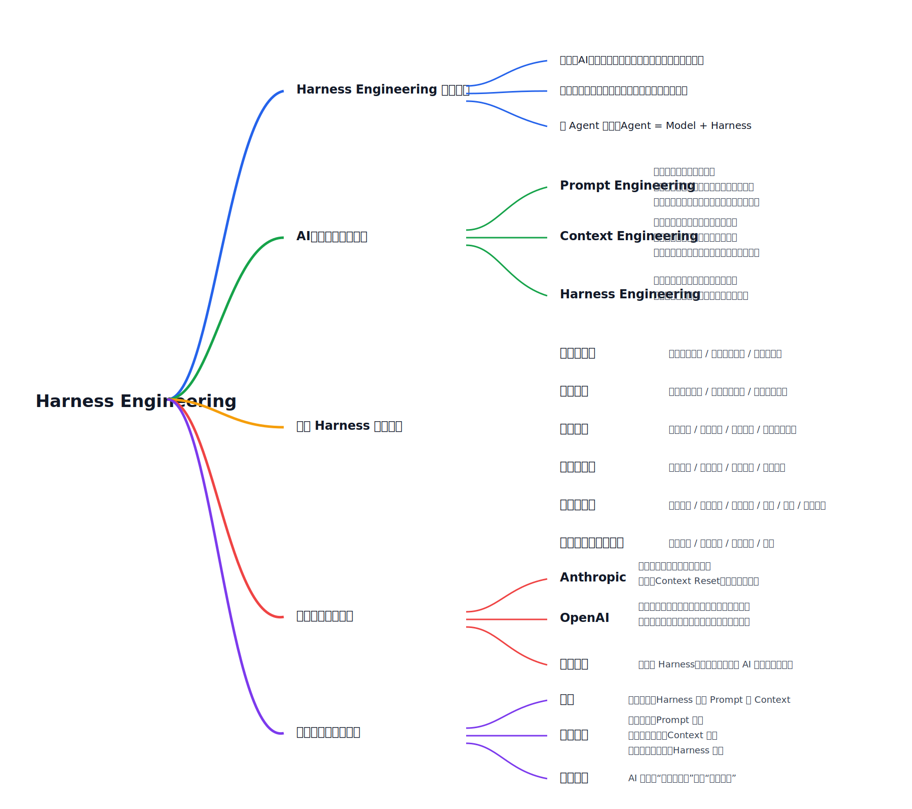

# Harness Engineering 初探与演进比较

- Created: 2026-04-10
- Updated: 2026-04-10
- Type: learning
- Status: draft
- Tags: harness-engineering, prompt-engineering, context-engineering, agents
- Model: GPT-5.4
- Harness: Codex
- Source: organized from a user-provided summary and mind map of the Bilibili video “最近爆火的 Harness Engineering 到底是啥？一期讲透！”

## 背景

这份笔记只做一个轻量版本，用来快速建立对 `Harness Engineering` 的第一印象。

核心目标不是讲深实现，而是先回答：

- `Harness Engineering` 到底在说什么
- 它和 `Prompt Engineering`、`Context Engineering` 的区别是什么
- 为什么很多 AI 系统的重心会从“模型更聪明”转向“系统更稳定”

## 脑图

## 简要总结

### 1. 核心定义

可以先把 `Harness Engineering` 理解为：

> AI 系统中除模型本身之外，那套决定系统是否能稳定交付的运行系统。

它关注的重点不是让模型“更会说”，而是：

- 不跑偏
- 跑得稳
- 出错可恢复

这也是为什么可以把很多 agent 粗略理解成：

> `Agent = Model + Harness`

### 2. 三个阶段的演进关系

#### Prompt Engineering

主要解决：

- 模型是否听懂指令

核心更偏：

- 塑造局部概率空间
- 优化语言表达

它的局限是：

- 无法补知识缺失
- 不擅长管理长链路状态

#### Context Engineering

主要解决：

- 模型是否获取了足够且正确的信息

核心更偏：

- 在合适时机输送和当前决策相关的全部信息

常见实践包括：

- 检索增强
- 渐进式披露
- 上下文优化

#### Harness Engineering

主要解决：

- 模型在真实执行中能否持续做对

核心更偏：

- 全流程驾驭
- 监督
- 约束
- 纠偏

### 3. 成熟 Harness 的六层结构

从这张脑图看，一个成熟 harness 可以先压成 6 层：

1. `上下文管理`
   角色目标定义、信息裁剪选择、结构化组织
2. `工具系统`
   工具合理配置、调用时机、结果提炼回喂
3. `执行编排`
   目标理解、信息补全、分析生成、输出校验修正
4. `记忆与状态`
   任务状态、中间结果、长期记忆和用户偏好
5. `评估与观测`
   输出验收、环境验证、自动测试、日志、指标、错误归因
6. `约束校验与失败恢复`
   行为约束、输出校验、失败重试、回滚

### 4. 企业实践的直觉化理解

这份总结里提到的几个实践方向可以先这样理解：

- `Anthropic`
  重点在处理上下文溢出和自评失真，例如 `Context Reset`、把生产执行和最终验收分开。
- `OpenAI`
  更强调工程师角色转向“设计环境、拆解任务、建立反馈”，以及渐进式披露、自主验证、自动治理系统。
- `其他企业`
  即使不改模型本身，只优化 harness，也可能大幅提升系统效率和效果。

### 5. 落地意义

这三者更像包含关系，而不是互相替代：

- `Prompt` 解决“怎么说”
- `Context` 解决“给什么”
- `Harness` 解决“怎么稳定工作”

一个简单判断标准是：

- 单轮生成：更偏 `Prompt Engineering`
- 外部知识依赖：更偏 `Context Engineering`
- 长链路真实任务：`Harness Engineering` 变成必需

所以更大的趋势是：

> AI 落地的重心，正在从“模型更聪明”逐步转向“系统能否稳定工作”。

## 来源视频

- Bilibili：[最近爆火的 Harness Engineering 到底是啥？一期讲透！](https://www.bilibili.com/video/BV1Zk9FBwELs/?share_source=copy_web&vd_source=e11d1aa23ea058d42b676f314fe822a0)

## 注意事项

- 这份笔记基于你提供的视频脑图与文字总结整理，不是基于完整视频逐字稿复原。
- 这里刻意保持轻量，只保留第一层理解框架。
