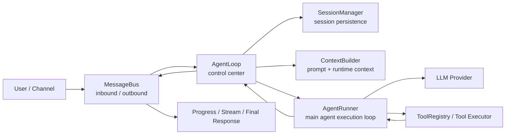
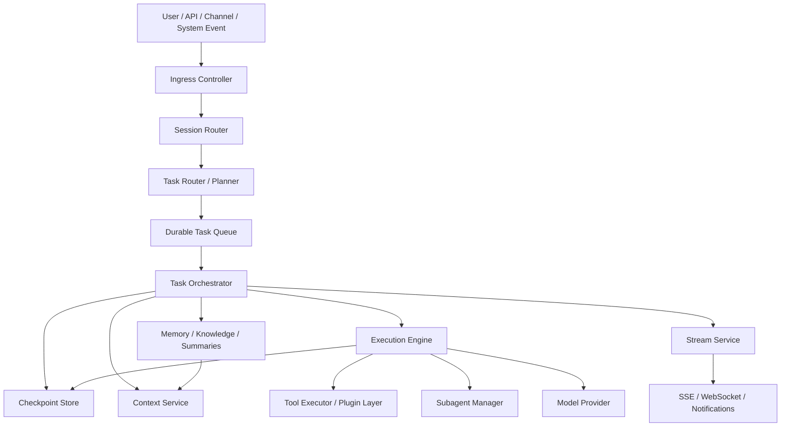

# 从 nanobot 拆主 agent、中控、调度、队列与上下文管理

- Created: 2026-04-08
- Updated: 2026-04-08
- Type: learning
- Status: verified
- Tags: nanobot, agents, orchestration, scheduler, queue, context, architecture
- Model: GPT-5.4
- Harness: Codex
- Source: official nanobot source code plus selected official harness docs

> Metadata quick notes:
> `Model` = the underlying model itself.
> `Harness` = the agent/runtime layer wrapped around the model.
> Full definitions: `playbooks/repository/metadata-field-reference.md`

## 背景

这份笔记不是单纯为了读懂 `nanobot`。

它更直接服务于两个目标：

- 搞清楚一个轻量 agent harness 是如何组织“主 agent / 中控 / 调度 / 队列 / 上下文管理”的
- 把这些结构反推到你自己的“万能服务中控系统”里，形成一个可以落地的控制平面设计

之前在看 `nanobot` 时，最容易混淆的一点是：

- `gateway()` 这种入口函数很显眼
- 但真正和“主中控如何持续推进任务、如何避免消息混淆、如何维护上下文”最相关的，并不是入口层

真正关键的，是这些核心文件：

- `nanobot/agent/loop.py`
- `nanobot/agent/runner.py`
- `nanobot/agent/context.py`
- `nanobot/bus/queue.py`
- `nanobot/session/manager.py`

## 问题或目标

这份笔记最想回答的问题是：

> 如果把 `nanobot` 当成一个轻量版 agent runtime，它到底是如何完成主 agent 驱动、中控编排、调度隔离、消息队列和上下文管理的；这些设计哪些值得学，哪些不足，以及如何迁移到一个更强的万能服务中控系统里？

## 先把整件事拆开

先把这 5 个部分分清：

1. `主 agent`
   不是“整个系统”，而是那个负责一轮一轮决定“下一步做什么”的执行引擎。
   在 `nanobot` 里，核心更接近 `AgentRunner`。
2. `中控`
   负责把 session、commands、tools、runner、streaming、checkpoint、持久化这些东西串起来。
   在 `nanobot` 里，更接近 `AgentLoop`。
3. `调度`
   负责决定不同消息怎么进入执行流程，以及并发时如何隔离。
   在 `nanobot` 里，核心在 `run()` 和 `_dispatch()`。
4. `队列`
   负责把外部消息输入和内部结果输出解耦。
   在 `nanobot` 里，是很轻的 `MessageBus`。
5. `上下文管理`
   不只是 prompt 拼接，而是“系统最终把哪些东西带进当前一轮推理”。
   在 `nanobot` 里，分散在 `ContextBuilder + SessionManager + AgentRunner` 的上下文治理逻辑里。

一句话先记住：

> `nanobot` 的结构不是“一个超大 Agent 类包办一切”，而是 `AgentLoop` 做产品层中控，`AgentRunner` 做执行引擎，`MessageBus / SessionManager / ContextBuilder` 分别负责运输、持久化和上下文拼装。

## 一张总图



如果再把职责说得更精确一点：

- `MessageBus` 负责“消息怎么进来、怎么出去”
- `AgentLoop` 负责“这条消息按什么产品流程走”
- `ContextBuilder` 负责“本轮模型到底看到了什么”
- `AgentRunner` 负责“模型怎么一轮轮继续做事直到停止”
- `SessionManager` 负责“历史怎么保存、恢复和裁剪”

## 核心源码索引

### 1. 主 agent / 执行引擎

- `nanobot/agent/runner.py`
- 关键方法：
  - `AgentRunner.run`
  - `_request_model`
  - `_execute_tools`
  - `_run_tool`
  - `_snip_history`
  - `_partition_tool_batches`

### 2. 中控 / 控制平面

- `nanobot/agent/loop.py`
- 关键方法：
  - `AgentLoop.__init__`
  - `_run_agent_loop`
  - `run`
  - `_dispatch`
  - `_process_message`
  - `_save_turn`
  - `_restore_runtime_checkpoint`

### 3. 调度

- `nanobot/agent/loop.py`
- 关键方法：
  - `run`
  - `_dispatch`
  - `_active_tasks`
  - `_session_locks`
  - `_concurrency_gate`

### 4. 队列

- `nanobot/bus/queue.py`
- 关键对象：
  - `MessageBus.inbound`
  - `MessageBus.outbound`
  - `publish_inbound / consume_inbound`
  - `publish_outbound / consume_outbound`

### 5. 上下文管理

- `nanobot/agent/context.py`
- `nanobot/session/manager.py`
- `nanobot/agent/runner.py`
- 关键方法：
  - `ContextBuilder.build_system_prompt`
  - `ContextBuilder.build_messages`
  - `Session.get_history`
  - `_save_turn`
  - `_restore_runtime_checkpoint`
  - `_microcompact`
  - `_apply_tool_result_budget`
  - `_snip_history`

## 抽取后的最小代码骨架

这一节不是逐字复制源码，而是把 5 个部分压成最小实现轮廓，方便以后迁移到你自己的系统里。

### 1. 队列层

```python
class MessageBus:
    def __init__(self):
        self.inbound = asyncio.Queue()
        self.outbound = asyncio.Queue()

    async def publish_inbound(self, msg):
        await self.inbound.put(msg)

    async def consume_inbound(self):
        return await self.inbound.get()

    async def publish_outbound(self, msg):
        await self.outbound.put(msg)
```

### 2. 中控 + 调度层

```python
class AgentLoop:
    def __init__(self):
        self.context = ContextBuilder(...)
        self.sessions = SessionManager(...)
        self.runner = AgentRunner(...)
        self._session_locks = {}
        self._concurrency_gate = asyncio.Semaphore(3)

    async def run(self):
        while self._running:
            msg = await self.bus.consume_inbound()
            asyncio.create_task(self._dispatch(msg))

    async def _dispatch(self, msg):
        lock = self._session_locks.setdefault(msg.session_key, asyncio.Lock())
        async with lock, self._concurrency_gate:
            response = await self._process_message(msg)
            await self.bus.publish_outbound(response)
```

### 3. 主 agent 执行层

```python
class AgentRunner:
    async def run(self, spec):
        messages = list(spec.initial_messages)
        for iteration in range(spec.max_iterations):
            messages = govern_context(messages)
            response = await request_model(messages)

            if response.has_tool_calls:
                messages.append(assistant_tool_call_message(response))
                results = await execute_tools(response.tool_calls)
                messages.extend(tool_result_messages(results))
                continue

            return finalize(response, messages)
```

### 4. 上下文构建层

```python
class ContextBuilder:
    def build_system_prompt(self):
        return join(
            identity,
            bootstrap_files,
            memory,
            always_skills,
            skills_summary,
            recent_history,
        )

    def build_messages(self, history, current_message, channel, chat_id):
        runtime_ctx = build_runtime_context(channel, chat_id)
        return [
            {"role": "system", "content": self.build_system_prompt()},
            *history,
            {"role": "user", "content": runtime_ctx + "\n\n" + current_message},
        ]
```

### 5. 会话持久化层

```python
class SessionManager:
    def get_or_create(self, key):
        if key in cache:
            return cache[key]
        session = load_from_jsonl(key) or Session(key=key)
        cache[key] = session
        return session

    def save(self, session):
        write_jsonl(session)
```

这 5 段最小骨架其实已经把 `nanobot` 的控制平面思路表达出来了：

- `MessageBus` 负责运输
- `AgentLoop` 负责中控与调度
- `AgentRunner` 负责主 agent 决策循环
- `ContextBuilder` 负责本轮上下文
- `SessionManager` 负责连续性

## Part 1：主 agent

### 抽象设计逻辑

`nanobot` 里的“主 agent”不是一个人格文件，也不是 `AgentLoop` 本身。

更准确地说：

- `AgentLoop` 是控制壳子
- `AgentRunner` 才是“主 agent 的行动引擎”

它承担的是一种典型的 `tool-capable agent loop`：

1. 拿到当前消息列表
2. 做上下文治理
3. 调模型
4. 如果模型给出 tool calls，就执行工具
5. 把工具结果塞回消息列表
6. 再继续下一轮
7. 直到拿到最终回答，或者达到停止条件

这是一种“隐式规划”风格：

- 主 agent 并没有显式的 `Plan` 对象
- 也没有强状态机式的 task graph
- “下一步干什么”主要由模型在每一轮里通过 tool calling 来决定

所以它更像：

> 一个会反复试探、调工具、读结果、继续推进的执行闭环。

### 深入到代码中

`AgentRunner.run()` 是这部分的核心。

它的大逻辑可以压成下面这段伪代码：

```python
messages = initial_messages

for iteration in range(max_iterations):
    messages = context_governance(messages)
    response = request_model(messages)

    if response.has_tool_calls:
        append_assistant_tool_call_message()
        checkpoint("awaiting_tools")
        results = execute_tools(response.tool_calls)
        append_tool_results(results)
        checkpoint("tools_completed")
        continue

    if response.finish_reason == "length":
        continue_generation()

    finalize_and_break()
```

这里最值得注意的不是“循环”本身，而是它把几件重要的事串得很顺：

#### 1. 上下文治理先于每轮推理

每轮开始前，`run()` 会依次做：

- `_backfill_missing_tool_results`
- `_microcompact`
- `_apply_tool_result_budget`
- `_snip_history`

这意味着：

- agent 不是无脑把所有历史都喂给模型
- 它每一轮都会先做一次上下文治理
- 主 agent 的“思考材料”其实是被动态修整过的

#### 2. tool calls 是主 agent 的动作接口

如果模型返回了工具调用：

- 先构造 assistant message，并把 `tool_calls` 写进去
- 记录 checkpoint
- 再执行工具
- 执行完成后，再把 tool message 追加回消息列表

这让 LLM 决策和工具执行之间形成了清晰边界：

- LLM 负责决定“做什么”
- tools 负责执行“怎么做”
- runner 负责把二者组织成一个稳定循环

#### 3. 对异常和中断有一定恢复能力

这部分不是特别强，但已经比很多玩具 agent 更稳：

- 如果 response 为空，会尝试 retry / finalization retry
- 如果输出被截断，会插入 length recovery message 再继续
- 如果有工具结果丢失，会 backfill synthetic tool results
- 还会通过 checkpoint callback 把当前阶段写出去

#### 4. 工具并发是“带约束的并发”

`_partition_tool_batches()` 不会简单把所有工具调用一把并发掉。

它会根据工具的 `concurrency_safe` 属性做分批：

- 能安全并发的工具，可以同批执行
- 不能安全并发的工具，会单独串行跑

这点非常值得学，因为它说明：

> 真正稳定的 agent runtime，不能只问“能不能并发”，还要问“哪些工具适合并发”。

### 值得学习的点

- `AgentLoop` 和 `AgentRunner` 分层很清楚，产品壳和执行引擎没有完全混在一起。
- tool-calling loop 足够小，但已经具备真正的闭环感。
- 每轮推理前都有上下文治理，而不是把上下文管理当成一次性的 prompt build。
- 工具执行支持批处理和并发安全判断。
- checkpoint 插槽已经出现，说明系统开始具备“可恢复运行”的意识。

### 需要加强的点

- “下一步干什么”几乎完全依赖模型隐式决定，没有显式 task graph。
- 没有真正的一等公民 `Task` / `Plan` / `Step` 抽象。
- `max_iterations` 是个必要护栏，但仍然是比较粗糙的停止机制。
- 多轮推进虽然能工作，但更像工具循环，不是强结构化任务执行器。
- 工具结果回流到消息列表后，缺乏更高层的语义压缩，例如 step summary 或 task state summary。

### 应用到你的万能服务中控系统

如果代入你的系统，我不建议直接复制 `AgentRunner`，而建议做一个“强化版 runner”：

#### 方案

1. 保留 nanobot 这种 `tool-capable loop` 核心。
2. 在它前面加显式的 `Planner / Router`。
3. 在它内部引入 `TaskState / StepState`。
4. 每一轮不是只看 `messages`，还看当前 task 的结构化状态。

#### 建议的数据结构

```python
Task(
    task_id,
    session_id,
    goal,
    status,          # pending / running / waiting_user / blocked / done / failed
    current_step_id,
    budget,
    priority,
)

Step(
    step_id,
    task_id,
    kind,            # plan / tool / synthesize / ask_user / delegate
    status,
    input,
    output,
    depends_on=[],
)
```

#### 建议的执行循环

```python
while task.not_finished():
    context = context_service.build(task, session, memory)
    plan_delta = planner.maybe_update_plan(task, context)
    action = executor.decide_next_action(task, context)

    if action.type == "tool":
        result = tool_executor.run(action)
        task.record(result)
    elif action.type == "delegate":
        subtask = scheduler.spawn_subtask(action)
        task.record(subtask)
    elif action.type == "ask_user":
        task.pause_waiting_user()
    elif action.type == "finalize":
        task.complete()
```

也就是说：

- nanobot 给你的是“主 agent 循环”的核心骨架
- 你自己的系统应该在这层外面，再长一层显式任务结构

## Part 2：中控

### 抽象设计逻辑

在 `nanobot` 里，中控最接近 `AgentLoop`。

它不是“模型”，而是那个把下面这些东西装配在一起的控制中心：

- bus
- provider
- session manager
- context builder
- tool registry
- runner
- subagents
- consolidator / dream
- command router

它真正做的是：

> 让一条消息从“进来”，到“找到 session”，到“构建上下文”，到“跑主 agent”，到“保存结果”，再到“把进度/流式/最终输出发出去”，形成一个完整控制闭环。

### 深入到代码中

`AgentLoop.__init__()` 已经能看到这种“装配层”思路：

- `self.context = ContextBuilder(...)`
- `self.sessions = SessionManager(...)`
- `self.tools = ToolRegistry()`
- `self.runner = AgentRunner(provider)`
- `self.subagents = SubagentManager(...)`
- `self._session_locks`
- `self._concurrency_gate`

这说明 `AgentLoop` 本身并不想承担所有底层实现，它更像组合器。

然后，中控的关键路径是：

#### 1. `run()`

一直从 `bus.consume_inbound()` 拿消息。

它做两件关键事：

- 优先命令先走快捷路径
- 普通消息进入 `_dispatch()`

#### 2. `_dispatch()`

这是“调度 + 执行入口”的交界点。

它负责：

- 拿 session lock
- 走全局并发门
- 为流式输出构造 `on_stream / on_stream_end`
- 再把真正处理逻辑交给 `_process_message()`

#### 3. `_process_message()`

这是中控最核心的产品逻辑。

它会：

- 找到 session
- 恢复 checkpoint
- 跑 slash commands
- 触发 consolidator
- 设置 tool context
- 取 history
- 调 `ContextBuilder.build_messages()`
- 调 `_run_agent_loop()`
- 保存本轮 turn
- 清 checkpoint
- 持久化 session
- 派发 background consolidation
- 最终构造 outbound message

#### 4. `_run_agent_loop()`

这是中控对主 agent 的封装层。

它把：

- progress callback
- streaming callback
- checkpoint callback
- session / channel / chat_id 等运行信息

打包进 `AgentRunSpec` 再交给 `AgentRunner.run()`。

#### 5. `_restore_runtime_checkpoint()` 和 `_save_turn()`

这两个方法很重要，因为它们说明 `AgentLoop` 不只是“调模型”，它还承担运行恢复和持久化语义：

- `_restore_runtime_checkpoint()`：把未完成的 turn 补回历史，避免掉线后上下文断裂
- `_save_turn()`：把本轮新消息规范化写入 session，并清理 runtime context、超长工具结果、多模态大块内容

### 值得学习的点

- `AgentLoop` 清楚地站在“控制平面”位置，而不是把一切塞进 provider 或 tool layer。
- 产品层关注点和执行引擎关注点是分开的。
- progress、streaming、checkpoint 都通过 callback 接进来，扩展性不错。
- checkpoint 恢复做得很实用，尤其适合真实长任务。
- session 持久化、背景 consolidation、流式输出都在中控层收口，符合职责直觉。

### 需要加强的点

- `AgentLoop` 现在还是有点“大”：消息处理、控制编排、持久化、恢复、进度、工具上下文、背景任务全都在这里。
- 用户消息、system 消息、command shortcut 的逻辑都塞在一个类里，可维护性会逐步吃紧。
- 它管理的是 `session`，不是一等公民的 `task`。
- background work 仍然是进程内 task，不是持久化 job system。

### 应用到你的万能服务中控系统

你的系统如果也要做“万能服务中控”，我建议不要做一个更大的 `AgentLoop`，而是拆成下面几层：

### 推荐的控制平面拆分

1. `IngressController`
   负责接聊天平台、API、Web、系统事件。
2. `SessionService`
   负责 session 的查找、持久化、匿名化、会话边界。
3. `TaskOrchestrator`
   负责把输入路由到正确 task，并决定是新建任务还是续跑旧任务。
4. `ExecutionEngine`
   负责主 agent / subagent 的实际执行循环。
5. `StreamService`
   负责 progress、delta、final response 这三类输出。
6. `CheckpointService`
   负责恢复与中断续跑。
7. `BackgroundWorkers`
   负责 consolidation、summarization、reindex、offline eval。

这样做的好处是：

- `中控` 仍然存在
- 但它不再是一个超大类，而是一个小型 control plane

## Part 3：调度

### 抽象设计逻辑

这里最重要的一句话是：

> `nanobot` 解决的是“会话隔离”问题，不是真正的“复杂任务调度”问题。

它的调度策略其实很清晰：

- 同一个 session：串行
- 不同 session：并发
- 全局并发：受 semaphore 控制

这对“聊天助手”来说非常实用，因为它优先解决的是：

- 同一会话里消息不要乱交叉
- 不同会话之间不要互相阻塞

### 深入到代码中

调度的关键点都在 `AgentLoop.run()` 和 `_dispatch()`：

#### 1. 事件入口

`run()` 会不断从 `MessageBus.inbound` 消费消息。

如果是 priority command：

- 直接走 `dispatch_priority()`
- 不进入普通执行路径

否则：

- `asyncio.create_task(self._dispatch(msg))`

这说明 `nanobot` 的外层调度是“消息级 task 化”的。

#### 2. 会话级串行

`_dispatch()` 里最关键的一句是：

```python
lock = self._session_locks.setdefault(msg.session_key, asyncio.Lock())
```

然后：

```python
async with lock, gate:
    ...
```

这表示：

- 每个 `session_key` 一个 lock
- 同一 session 内的消息，不会并发跑

这是它防止消息混淆的核心手段。

#### 3. 全局并发门

`__init__()` 里还有：

```python
self._concurrency_gate = asyncio.Semaphore(_max)
```

默认通过环境变量 `NANOBOT_MAX_CONCURRENT_REQUESTS` 控制，总默认值是 `3`。

也就是说：

- 会话之间虽然允许并发
- 但全局不会无限开

#### 4. `_active_tasks`

`_active_tasks` 记录的是：

- 当前 session 下有哪些运行中的 asyncio task

这给取消、诊断和状态管理留下了最低限度的基础。

### 值得学习的点

- `per-session serial / cross-session concurrent` 这个策略很适合聊天型 agent。
- 实现简单，但非常有效。
- priority command 旁路很实用，例如 `/stop` 这类命令就不该排队等普通任务。
- 全局并发门能防止 agent runtime 被突发消息压垮。

### 需要加强的点

这里是 `nanobot` 对你最不够的地方之一。

为什么？

因为它的隔离单位是：

- `session_key`

但你未来的系统很可能真正需要的是：

- `session`
- `task`
- `step`

这三层分开。

目前 `nanobot` 的问题是：

- 同一 chat 里的多个任务，默认还是在同一个 session 线上
- 它能避免“同一会话消息并发混乱”
- 但不能天然支持“同一会话里多任务独立推进”

另外，它也没有：

- 优先级队列
- 持久化任务队列
- retry / dead-letter
- task preemption
- deadline / SLA scheduling

### 应用到你的万能服务中控系统

这一部分我建议你不要停留在 `session lock`，而是直接做三层调度模型。

### 建议的调度层次

1. `session`
   用户或会话容器。
2. `task`
   一个明确目标，例如“帮我写这份方案”“帮我跟进这个工单”“帮我做这轮 research”。
3. `work item`
   task 下的单步执行单元，例如：
   - 读取文档
   - 调某个工具
   - 跑某个 subagent
   - 等待用户补充

### 建议的调度策略

- 同一 `task_id`：严格串行
- 同一 `session_id` 下不同 task：有限并行，例如最多 2 个活跃任务
- 不同 session：全局 worker pool 控制
- system / admin / cancellation 请求：高优先级
- research / background summarization：低优先级

### 建议的数据表

```python
TaskQueueItem(
    item_id,
    session_id,
    task_id,
    step_id,
    priority,      # high / normal / low
    run_after,
    retry_count,
    status,
)
```

### 工程建议

如果你现在就做第一版，我不建议一开始就上 Kafka 这类重系统。

更实用的是：

- `Postgres` 存任务状态和 checkpoint
- `Redis` 做队列 / 锁 / pubsub
- `SSE/WebSocket` 做前端流式更新

这会比 `asyncio.Queue` 强很多，但还没重到难以迭代。

## Part 4：队列

### 抽象设计逻辑

`nanobot` 的队列层其实非常纯粹：

- 它只做运输
- 不做复杂调度
- 也不承载业务语义

`MessageBus` 的职责只有一件事：

> 把 chat channels 和 agent core 解耦。

### 深入到代码中

`MessageBus` 里只有两个 `asyncio.Queue`：

- `inbound`
- `outbound`

对应四个核心操作：

- `publish_inbound`
- `consume_inbound`
- `publish_outbound`
- `consume_outbound`

从抽象上看，这已经够表达一个最小 transport bus：

- channels 把消息投给 `inbound`
- agent core 从 `inbound` 取
- 处理完成后投给 `outbound`
- channels 再把 `outbound` 发回用户

更有意思的是：

`nanobot` 没有为 progress / stream / final response 单独搞三套传输系统，而是把它们都复用进 `outbound`，通过 metadata 区分：

- `_progress`
- `_tool_hint`
- `_stream_delta`
- `_stream_end`
- `_streamed`

这点很值得注意，因为它说明：

> 对一个轻量 harness 来说，“统一事件信封”比“为每种输出单独造一套传输协议”更划算。

### 值得学习的点

- 队列层足够薄，容易替换。
- 运输和执行解耦做得很干净。
- progress / streaming / final response 复用统一 outbound envelope，接口很轻。
- 这套设计非常适合作为单机或轻量部署的起点。

### 需要加强的点

`MessageBus` 很好学，但它显然不够成为你的最终方案。

因为它还没有：

- 持久化
- ack / replay
- retry
- priority
- dead-letter
- 多 worker 消费协调

它也不是：

- 任务队列
- 事件日志
- 工作流总线

它只是最小 transport bus。

### 应用到你的万能服务中控系统

我建议你明确拆出两层，而不是把所有东西都叫 queue：

### 第一层：EventBus

负责用户可感知事件：

- `InboundEvent`
- `ProgressEvent`
- `StreamDelta`
- `FinalResponse`
- `TaskStatusChanged`

### 第二层：TaskQueue

负责内部工作调度：

- `TaskRequest`
- `WorkItem`
- `RetryJob`
- `DelayedJob`

### 推荐的事件模型

```python
InboundEvent(session_id, task_id, content, metadata)
ProgressEvent(session_id, task_id, phase, detail)
StreamDelta(session_id, task_id, stream_id, delta)
FinalResponse(session_id, task_id, content)
TaskStatusChanged(task_id, old_status, new_status)
```

如果只做第一版：

- `TaskQueue` 用 Redis / Postgres
- `EventBus` 用 WebSocket 或 SSE

这样比 nanobot 多了一层 durability，但仍然足够轻。

## Part 5：上下文管理

### 抽象设计逻辑

`nanobot` 的上下文管理不是一个点，而是三层共同完成：

1. `ContextBuilder`
   负责静态和运行时上下文的拼装。
2. `SessionManager / Session`
   负责会话历史的持久化、截取和合法边界。
3. `AgentRunner`
   负责上下文预算治理，也就是“真正送给模型前再修一遍”。

所以它的上下文逻辑可以概括成：

> `系统提示 + bootstrap files + memory + skills + session history + runtime metadata + context governance`

### 深入到代码中

#### 1. `ContextBuilder.build_system_prompt()`

这一步会拼：

- identity
- bootstrap files
- memory
- always skills
- skills summary
- recent history

尤其值得注意的是 `BOOTSTRAP_FILES`：

- `AGENTS.md`
- `SOUL.md`
- `USER.md`
- `TOOLS.md`

这本质上是一种“文件驱动的长期上下文注入”。

#### 2. `ContextBuilder._build_runtime_context()`

这里有个非常值得学习的小设计：

- runtime metadata 被显式标记为：
  - `[Runtime Context — metadata only, not instructions]`

这个标签的意义很强：

- 它告诉模型：这块是上下文元数据，不是额外系统指令
- 这是一种 prompt hygiene

#### 3. `ContextBuilder.build_messages()`

它会把：

- system prompt
- history
- 当前 runtime context
- 当前 user message

拼成完整消息列表。

还做了一个很实用的兼容处理：

- 如果当前最后一条和新消息同 role，就合并
- 避免某些 provider 拒绝连续同角色消息

#### 4. `Session.get_history()`

它不是简单地“截最近 N 条消息”。

还会额外保证：

- 尽量从 user turn 开始
- 避免历史片段从非法 tool-call 边界开始

这很重要，因为 tool-calling message history 如果被截断在错误位置，会让模型读到半截上下文。

#### 5. `AgentRunner` 的 context governance

真正送模型前，runner 还会做三层治理：

- `_microcompact`
  - 把旧的、可压缩的 tool results 替换成摘要占位
- `_apply_tool_result_budget`
  - 对工具结果做长度预算裁剪
- `_snip_history`
  - 基于 token budget 保留系统消息和合法的最近历史后缀

这说明 `nanobot` 的设计思想是：

- prompt build 是第一层
- token governance 是第二层

#### 6. `_save_turn()` 和 `_restore_runtime_checkpoint()`

这两个方法又补上了第三层：

- `_save_turn()`
  - 把 runtime metadata 从用户消息里剥掉
  - 截断超长工具结果
  - 过滤不适合长期保留的多模态大块
- `_restore_runtime_checkpoint()`
  - 如果一轮中断了，把未完成的 assistant/tool 轨迹补回 session

所以 `nanobot` 的上下文管理其实不是一件事，而是三件事一起做：

1. 怎么构建
2. 怎么裁剪
3. 怎么持久化和恢复

### 值得学习的点

- runtime metadata 被显式标注为“不是 instruction”，很专业。
- bootstrap files + memory + skills 的层次很清晰。
- session history 会对 tool-call 边界做合法性处理。
- 上下文治理不是只靠 builder，而是推理前还会再处理一遍。
- checkpoint 恢复能避免长任务中断后“上下文失忆”。

### 需要加强的点

- system prompt 仍然是比较“整块拼接”的，随着能力增长容易变大。
- bootstrap files 的加载策略较粗，缺少按任务选择性装载。
- `session history` 和 `task working memory` 没有完全分层。
- 缺少显式的 `task summary / scratchpad / retrieved docs` 等专门上下文层。
- 对长期知识的使用还比较轻，更多是文件拼接而不是检索排序。

### 应用到你的万能服务中控系统

对你的系统，我最建议直接做“分层上下文包”。

### 推荐的 ContextPack 结构

1. `Policy Layer`
   系统规则、权限、红线、平台策略。
2. `Mission Layer`
   当前系统主线、workspace 约束、项目背景。
3. `Session Layer`
   当前对话摘要、最近关键交互。
4. `Task Layer`
   当前 task 的目标、状态、计划、已完成步骤、待完成步骤。
5. `Working Set`
   本轮最相关的工具结果、文档片段、结构化变量。
6. `Retrieval Layer`
   从知识库 / 记忆系统召回的资料。
7. `Runtime Metadata`
   channel、time、user id、device、request id 等，但显式标为非指令。

### 建议的预算策略

- `Policy Layer`：固定保留
- `Task Layer`：固定保留摘要，不保留全部原始轨迹
- `Working Set`：按最近和相关性动态保留
- `Retrieval Layer`：有明确 token budget，超出就 rerank
- `Tool Results`：默认对象存储，prompt 只放摘要或片段

### 推荐的长期策略

- 会话长了以后，不是简单删历史
- 而是把旧步骤压缩成 `task summary`
- 再把 task summary 留给后续轮次

这是 `nanobot` 已经露出雏形，但你自己的系统应该做得更强的地方。

## 把这五部分重新串起来

如果把 `nanobot` 的思路压成一句话：

> 一个消息先进总线，再进入中控；中控根据 session 找历史、组上下文、调用主 agent；主 agent 通过 tool-calling 循环持续推进任务；执行结果再回到 session 与总线中。

但如果把它升级成你的“万能服务中控系统”，我建议再长出三层：

1. `显式 Task 层`
   不再让 session 直接等于任务。
2. `耐久化 Queue / Checkpoint 层`
   不再只靠进程内队列和内存锁。
3. `层化 ContextPack`
   不再只靠单块 system prompt 和原始 history。

## 再往深一层：为什么 nanobot 值得学，但不能直接照搬

`nanobot` 最值得学的，不是“它已经够强”。

恰恰相反，它值得学，是因为它刚好处在一个非常好的复杂度区间：

- 不会轻到只有聊天壳
- 也不会重到一开始就看不懂

它已经具备了：

- 真正的主 agent loop
- session 隔离
- 流式输出挂钩
- tool batching
- checkpoint 恢复
- context governance

但又还没有走到：

- 显式 planner
- durable workflow engine
- 多租户 job scheduler
- 多级 memory orchestration

所以它特别适合拿来做：

- `轻量版中控系统` 的学习样本
- `你自己系统 V1` 的设计起点

而不是最终答案。

## 参考更成熟 harness 的设计启发

这里不做深度源码拆解，只抓对你系统最有用的设计方向。

### 1. Claude Code：上下文分层、subagent 隔离、hooks

从 Anthropic 官方文档里，最值得借的有 3 点：

- memory 是分层加载的，有 enterprise / project / user 等层次
- subagents 拥有独立 context window 和可限制的工具权限
- hooks 可以在 prompt submit、tool 前后、session 生命周期等位置挂控制逻辑

对你的系统的直接启发是：

- 上下文一定要分层，不要把所有东西扔进一块 prompt
- subagent 一定要有“独立上下文 + 工具权限范围”
- 中控一定要给 policy / audit / metrics 留 hook 点

### 2. OpenClaw：把 gateway 当成长期运行的 control plane

从 OpenClaw 官方资料里，最值得借的是：

- `gateway` 被明确当成长期运行的“大脑 / 控制平面”
- 客户端只是消费者
- plugin 同时打包工具和 skills，能力扩展是模块化接入的

对你的系统的启发是：

- 把中控系统当成长期运行服务，而不是一次性函数
- 工具能力接入最好走插件/能力模块，而不是散落在代码里
- streaming、状态、控制调用，应该被统一收口到 control plane

### 3. OpenAI Harness Engineering：知识外化、可读性、反馈闭环

OpenAI 官方关于 harness engineering 的一条很重要的思路是：

- 让知识和规则尽可能在 repo / files / feedback loop 中外化
- 不要过度依赖模型“凭空记住一切”

对你的系统来说，这对应的是：

- system rules 和 operator knowledge 要文件化 / 配置化
- 高价值运行痕迹要沉淀成可被未来 agent 复用的知识资产
- 调度、失败、恢复、评测要形成反馈回路，而不是只看模型一次答得好不好

## 适配到“万能服务中控系统”的可执行方案

下面给一版更偏工程落地的方案。

## 方案目标

你想做的不是普通聊天机器人，而是一个：

- 能接多种输入
- 能长期推进任务
- 能调各种服务和工具
- 能做子任务分派
- 能避免任务互相串线
- 能沉淀长期记忆和知识资产

的“万能服务中控系统”。

### 推荐架构



### 一等公民数据模型

```python
Session(
    session_id,
    user_id,
    channel,
    active_task_ids=[],
)

Task(
    task_id,
    session_id,
    goal,
    status,
    priority,
    budget,
    current_step_id,
    summary,
)

Step(
    step_id,
    task_id,
    kind,
    status,
    input,
    output,
    depends_on=[],
)

Checkpoint(
    task_id,
    phase,
    assistant_state,
    tool_results,
    pending_calls,
)
```

### 运行流程

1. 用户请求进入 `Ingress Controller`
2. `Session Router` 找到或创建 `session_id`
3. `Task Router` 判断：
   - 这是新任务
   - 还是续跑已有任务
   - 还是对已有任务补充信息
4. 请求被转成一个 `TaskQueueItem`
5. `Task Orchestrator` 拉取 item，锁住 `task_id`
6. `Context Service` 构建本轮 `ContextPack`
7. `Execution Engine` 跑主 agent loop
8. 工具结果、progress、checkpoints 持续写回
9. `Stream Service` 向前端持续推送 delta / progress / final response
10. 后台 worker 定期做 summary / consolidation / knowledge promotion

### 你最该优先做的 6 个点

1. 先把 `session` 和 `task` 拆开
   这是从 nanobot 升级到真正中控系统的第一步。
2. 先把 queue 和 event bus 拆开
   一个负责任务，一个负责可视化输出。
3. 先把 `AgentRunner` 风格的 tool loop 做稳
   不要一上来就做巨复杂 planner。
4. 先做 checkpoint + resume
   长任务中断恢复会非常关键。
5. 先做分层上下文包
   不要让 prompt 只靠原始 history 堆出来。
6. 先给 subagent 留接口
   即使第一版不用，也要设计独立 task / context / tool scope 的位置。

### 一个现实可行的分阶段路线

#### V1：轻量中控

- `MessageBus` 升级成 `EventBus + TaskQueue`
- `AgentLoop/Runner` 二分继续保留
- 明确 `session_id / task_id`
- `Postgres + Redis + SSE`
- 单主 agent + tools

目标：

- 跑通单任务长期推进
- 能流式更新
- 能恢复中断
- 不串任务

#### V2：显式任务结构

- 引入 `Task / Step / Plan`
- 增加 priority / retry / timeout / waiting_user
- 上下文加入 `task summary`
- 背景 summarizer 和 evaluator

目标：

- 能稳定处理多任务
- 能解释“当前任务进行到哪一步”

#### V3：多 agent 控制平面

- subagent manager
- 工具权限隔离
- 任务委派
- hook / policy / audit
- 评测与数据闭环

目标：

- 从“能跑”走向“可控、可观测、可扩展”

## 最容易混淆的点

### 1. 主 agent 不等于中控

在 `nanobot` 里：

- `AgentRunner` 更像主 agent 执行引擎
- `AgentLoop` 更像中控

### 2. 队列不等于调度

- `MessageBus` 解决的是运输和解耦
- `_dispatch()` 解决的是调度和并发隔离

### 3. session 不等于 task

这是你自己的系统里一定要拆开的地方。

`nanobot` 在这方面是轻量设计，不适合直接当你的最终抽象。

### 4. 上下文管理不等于 system prompt

真正的上下文管理至少包括：

- prompt 结构
- 历史裁剪
- 工具结果治理
- checkpoint 恢复
- 记忆召回

### 5. 流式输出不等于中控能力

streaming 只是输出通道的一部分。

真正的中控能力，重点仍然是：

- 任务推进
- 状态维护
- 并发隔离
- 恢复与观测

## 一句话心智模型

- `AgentRunner` 是主 agent 的执行引擎。
- `AgentLoop` 是把主 agent、session、streaming、checkpoint 和 tools 串起来的中控。
- `MessageBus` 是消息运输层，不是复杂调度器。
- `nanobot` 的调度强在会话隔离，弱在任务结构化。
- `nanobot` 的上下文管理是“拼装 + 治理 + 恢复”三层协作。
- 你的万能服务中控系统，应该在 nanobot 之上再长出 `Task`、`Checkpoint`、`Durable Queue` 和 `ContextPack` 这几层。

## 注意事项

- 这份分析基于 `2026-04-08` 当天读取的 `nanobot` 官方 `main` 分支源码，未来实现可能变化。
- 这里的“主 agent / 中控 / 调度 / 队列 / 上下文管理”是为理解和设计迁移而做的概念分层，并不是 `nanobot` 自己代码中的官方模块名。
- `nanobot` 是轻量 harness，适合学思路，不适合机械照搬成复杂生产系统。
- 本文对 Claude Code、OpenClaw、OpenAI harness engineering 的引用，主要是用来借设计方向，不是说它们和 `nanobot` 在实现层面完全同构。

## 验证

- 2026-04-08：基于官方 `nanobot` 源码文件人工精读并结构化整理：
  - `nanobot/agent/loop.py`
  - `nanobot/agent/runner.py`
  - `nanobot/agent/context.py`
  - `nanobot/bus/queue.py`
  - `nanobot/session/manager.py`
- 2026-04-08：补充参考官方文档：
  - Claude Code `memory / sub-agents / hooks`
  - OpenClaw `gateway` 与 control plane 相关资料
  - OpenAI `Harness Engineering`

## 相关笔记

- [LLM 流式输出与 LangGraph 流机制](llm-streaming-and-langgraph-streaming.md)

## 参考

- [nanobot/agent/loop.py](https://github.com/HKUDS/nanobot/blob/main/nanobot/agent/loop.py)
- [nanobot/agent/runner.py](https://github.com/HKUDS/nanobot/blob/main/nanobot/agent/runner.py)
- [nanobot/agent/context.py](https://github.com/HKUDS/nanobot/blob/main/nanobot/agent/context.py)
- [nanobot/bus/queue.py](https://github.com/HKUDS/nanobot/blob/main/nanobot/bus/queue.py)
- [nanobot/session/manager.py](https://github.com/HKUDS/nanobot/blob/main/nanobot/session/manager.py)
- [Anthropic: Manage Claude's memory](https://docs.anthropic.com/en/docs/claude-code/memory)
- [Anthropic: Subagents](https://docs.anthropic.com/en/docs/claude-code/sub-agents)
- [Anthropic: Hooks reference](https://docs.anthropic.com/en/docs/claude-code/hooks)
- [OpenClaw: Discovery and transports](https://docs.openclaw.ai/gateway/discovery)
- [openclaw/nix-openclaw README](https://github.com/openclaw/nix-openclaw)
- [OpenAI: Harness engineering](https://openai.com/index/harness-engineering/)
